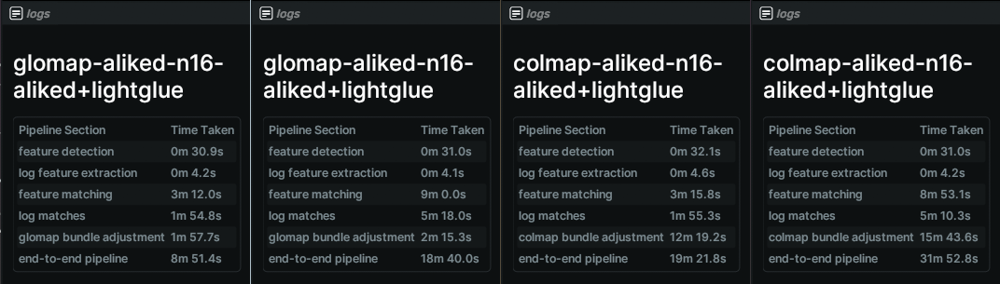

# Hierarchical Localization and GLOMAP

A repo to use GLOMAP Structure-From-Motion mapper with Hierarchical Localization toolbox for a faster mapper with deep learned features and matchers.
Uses [Rerun](https://rerun.io/) to visualize, [Gradio](https://www.gradio.app) for an interactive UI, and [Pixi](https://pixi.sh/latest/) for a easy installation

<p align="center">
    <a title="Personal Website" href="https://pablovela.dev/" target="_blank" rel="noopener noreferrer" style="display: inline-block;">
        
    </a>
    <a title="Github" href="https://github.com/pablovela5620/InstantSplat" target="_blank" rel="noopener noreferrer" style="display: inline-block;">
        
    </a>
    <a title="Social" href="https://x.com/pablovelagomez1" target="_blank" rel="noopener noreferrer" style="display: inline-block;">
        
    </a>
  </p>

<p align="center">
  
</p>

## Install and Run
### Using Pixi
Make sure you have the [Pixi](https://pixi.sh/latest/#installation) package manager installed

to use gradio interface
```bash
pixi run app
```
to use cli
```bash
pixi shell
python tools/reconstruct.py --help
```
Running splatting
`DATA_DIR="$OUTPUT-PATH" pixi run train-splat `

All commands can be listed using `pixi task list`

## Time Comparison
<p align="center">
  
</p>
**Note**: The time comparison shown above is based on a single example and is very anecdotal. It may not represent the performance in all scenarios.

The above compares glomap with colmap using the same feature+matcher but different pair generations (sequential v.s. vocab tree)

| Matching Type               | GLOMAP Reconstruction Time | COLMAP Reconstruction Time |
|-----------------------------|----------------------------|----------------------------|
| Vocabulary Tree Matching    | 18 minutes 40 seconds                 | 31 minutes 52 seconds                 |
| Sequential w/ Loop Closure  | 8 minutes 51 seconds                  | 19 minutes 21 seconds                  |

## Acknowledgements
Thanks to the original GLOMAP and hloc repos!

[hloc](https://github.com/cvg/Hierarchical-Localization)
```bibtex
@inproceedings{sarlin2019coarse,
  title     = {From Coarse to Fine: Robust Hierarchical Localization at Large Scale},
  author    = {Paul-Edouard Sarlin and
               Cesar Cadena and
               Roland Siegwart and
               Marcin Dymczyk},
  booktitle = {CVPR},
  year      = {2019}
}
```
[GLOMAP](https://github.com/colmap/glomap)
```bibtex
@inproceedings{pan2024glomap,
    author={Pan, Linfei and Baráth, Dániel and Pollefeys, Marc and Sch\"{o}nberger, Johannes Lutz},
    title={Global Structure-from-Motion Revisited},
    booktitle={European Conference on Computer Vision (ECCV)},
    year={2024},
}
```
